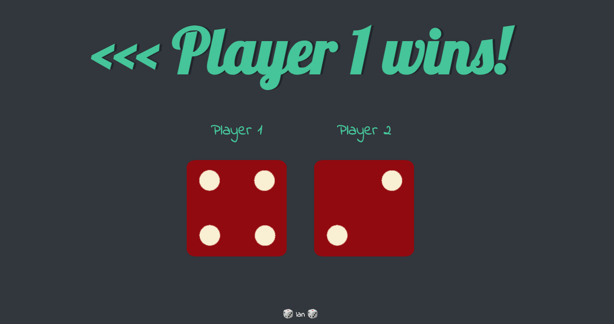

## JavaScript Dicee Challenge

### Overview

The Dicee Challenge is a fun, interactive simple web application built with JavaScript.

- The application simulates rolling two dice and determines the winner based on the outcome of the rolls.
- Random Dice Rolls: Each refresh of the page simulates rolling two dice.

### Technologies Used

- JavaScript
- CSS3
- HTML5

### Screenshots

